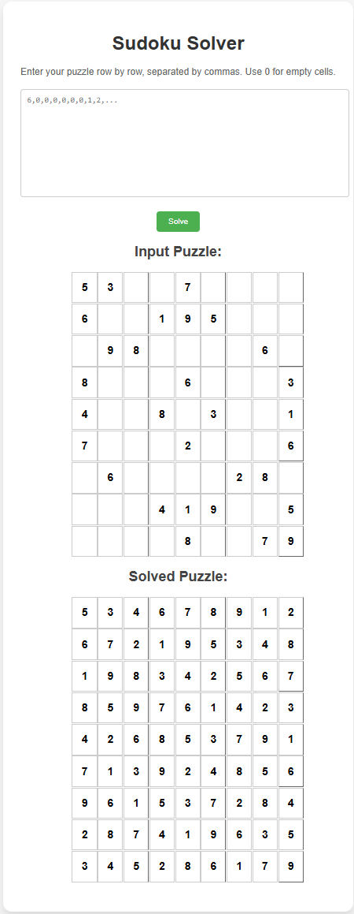

# 🧩 **AI-Powered Sudoku Solver**  
[](https://fastapi.tiangolo.com/)
[](https://pytorch.org/)
[](https://pytorch-geometric.readthedocs.io/)
[](https://opensource.org/licenses/MIT)

---

## 🎯 **Project Overview**

**AI-Powered Sudoku Solver** is an intelligent web application that solves Sudoku puzzles using:
- **Graph Neural Networks (GNN)** for predicting cell values.
- **Depth-First Search (DFS) Backtracking** for ensuring puzzle validity.
- Built with **FastAPI** for blazing fast performance and deployment-ready REST API.


## ✨ **Features**

- ✅ **AI-Powered Sudoku Solver** using Graph Neural Networks.
- ✅ **Intuitive UI** with grid-like display for input and output.
- ✅ **DFS Backtracking** for error correction and optimal solutions.
- ✅ **Responsive Design** for mobile and desktop.
- ✅ **Deployable on Deta Space** or any cloud platform.

---

## 📸 **Screenshots**




### 🎨 **Beautiful and Intuitive UI**
- Input grid for entering Sudoku puzzles.
- Solution grid for displaying solved puzzles.
- Easy-to-use **"Solve"** button for instant solutions.

---

## 🧩 **Tech Stack**

- **Backend**: FastAPI, Python
- **Frontend**: Jinja2 Templates, HTML, CSS
- **Machine Learning**: PyTorch, Graph Neural Networks
- **Deployment**: Deta Space / Fly.io (or any cloud platform)

---

## 🛠️ **Installation and Setup**

1. **Clone the repository:**
   ```sh
   git clone https://github.com/your-username/sudoku-solver.git
   cd sudoku-solver
   ```

2. **Create a virtual environment:**
   ```sh
   python -m venv env
   source env/bin/activate    # On Windows: .\env\Scripts\activate
   ```

3. **Install dependencies:**
   ```sh
   pip install -r requirements.txt
   ```

4. **Start the FastAPI server:**
   ```sh
   uvicorn main:app --reload
   ```

5. **Visit the application at:**
   ```
   http://127.0.0.1:8000
   ```


## 🎮 **Let's Solve Sudoku!**
- Give it a try and become a Sudoku master!
- **Share the app** with your friends and family.

---

## 🎉 **Happy Solving!** 🎉

